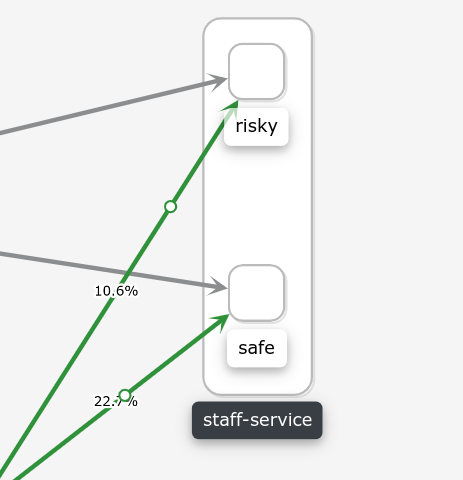
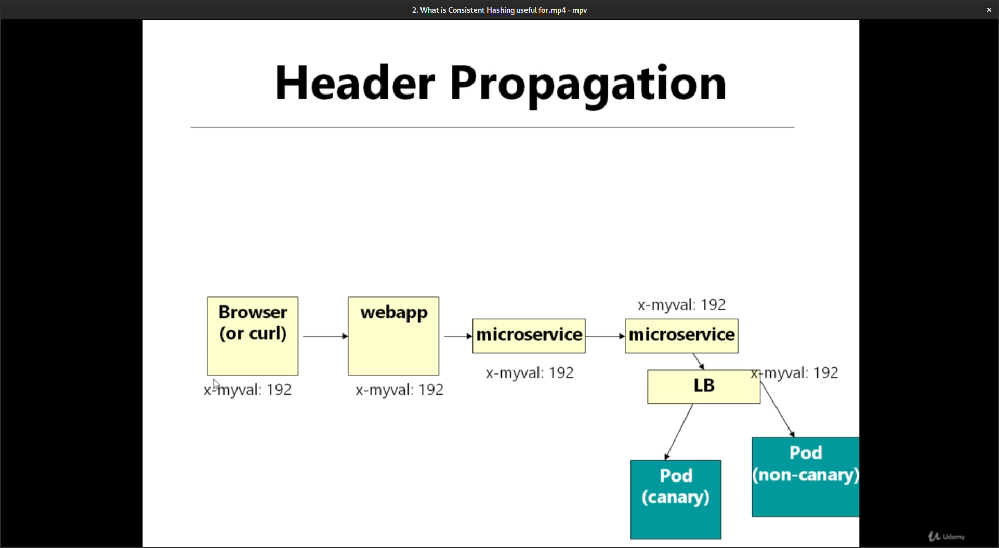
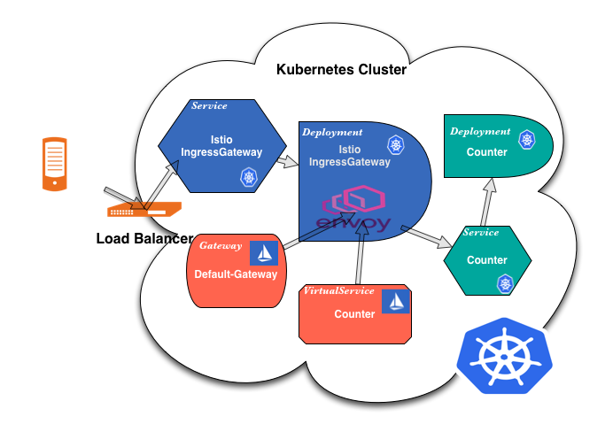

# Istio

An Istio service mesh is logically split into a data plane and a control plane.

The data plane is composed of a set of intelligent proxies (Envoy) deployed as sidecars. These proxies mediate and control all network communication between microservices. They also collect and report telemetry on all mesh traffic.

The control plane manages and configures the proxies to route traffic.


## Setup Istio control plane

### Warmup setup way: Using pre-generated K8s config

1. Setup Istio control plane

[istio-init.yaml](./isitio-fleetman/init-istio/istio-init.yaml): Initialize Istio custom resource definitions

> k apply -f istio-init.yaml

[istio-minikube.yaml](./isitio-fleetman/init-istio/istio-minikube.yaml): Create control plane components

> k apply -f istio-minikube.yaml

2. Setup kiali username and passprase secret

[kiali-secret.yml](./isitio-fleetman/init-istio/kiali-secret.yml)

> k apply -f kiali-secret.yml

3. Setup Istio data plane

There are multiple ways of doing this but here we will do it by setting a label on working namespace and let the istio to attach the sidecar proxies:

> k label namespace default istio-injection=enabled

> k describe ns default

```sh
Name:         default
Labels:       istio-injection=enabled
Annotations:  <none>
Status:       Active

No resource quota.

No LimitRange resource.
```

### Istio control plane components

- Galley: Reads K8s config (or other orchestration platform) and convert it in the internal format that Istion understands.

- Pilot: Receive formmated configuarion and propagate it across the proxies

- Citadel: Managing TLS/SSL certifciates e.g. secure cominucation between proxies

### What is required for distributed tracing with Istio?(https://istio.io/latest/faq/distributed-tracing/#how-to-support-tracing)

The application needs to propagate the trace context. For example in case of an HTTP request you need to read tracing headers (**x-request-id**, x-b3-traceid, x-b3-spanid, x-b3-parentspanid, x-b3-sampled, x-b3-flags, b3) and send them alongside with the response.

As a side note, the `x-request-id` will be generated by sidecard proxies and attacted to the request if it's not exists.

### Traffic management

- Kiali uses `app` label in app graph and `version` label in version graph

```yml
metadata:
  labels:
    app: staff-service
    version: safe
---
metadata:
  labels:
    app: staff-service
    version: risky
```



### Istio virtual service

vs:

Virtual services enables us to configure custom routing to the service mesh.

Virtual services are managed by pilot and allows us to change the side-car proxies configuration in a dynamic fashion and manage the incoming traffic that way.

_Despite the name virtual services and services (K8s's services) aren't really related_

dr:

Defining which pod should be a part of each subset

## VS and DR configuration

```yaml
apiVersion: networking.istio.io/v1beta1
kind: VirtualService
metadata:
  name: fleetman-staff-service # "Just" a name for the virtual service
  namespace: default
spec:
  hosts:
    - fleetman-staff-service.default.svc.cluster.local # The service DNS (i.e the regular K8s service) name that we're applying routing rules to. (In this case the name of the cluster IP)
  http:
    - route:
        - destination:
            host: fleetman-staff-service.default.svc.cluster.local # The target service DNS name (In this case the name of the cluster IP)
            subset: safe # Pointing to the name that have been defined by destination rule
          weight: 0 # Should be integer and not floating point numbers
        - destination:
            host: fleetman-staff-service.default.svc.cluster.local # The target service DNS name
            subset: risky
          weight: 100 # Should be integer and not floating point number
---
apiVersion: networking.istio.io/v1beta1
kind: DestinationRule
metadata:
  name: fleetman-staff-service # "Just" a name for destination rule
  namespace: default
spec:
  host: fleetman-staff-service.default.svc.cluster.local # The target service DNS name (In this case the name of the cluster IP)
  trafficPolicy: ~
  subsets:
    - labels: # This is actually a pod SELECTOR
        version: safe # The target pod should have this label
      name: safe
    - labels: # This is actually a pod SELECTOR
        version: risky # The target pod should have this label
      name: risky
```

### Load balancing

### Session affinity (Sticky session) load balancing

In the following example we uses request header as input of consistent hashing load balancer.

```yml
apiVersion: networking.istio.io/v1beta1
kind: VirtualService
metadata:
  name: fleetman-staff-service
  namespace: default
spec:
  hosts:
    - fleetman-staff-service.default.svc.cluster.local
  http:
    - route:
        - destination:
            host: fleetman-staff-service.default.svc.cluster.local
            subset: all-staff-service
          weight: 100
---
apiVersion: networking.istio.io/v1beta1
kind: DestinationRule
metadata:
  name: fleetman-staff-service
  namespace: default
spec:
  host: fleetman-staff-service.default.svc.cluster.local
  trafficPolicy:
    loadBalancer:
      consistentHash:
        httpHeaderName: "x-myval"
  subsets:
    - labels:
        app: staff-service
      name: all-staff-service
```

**Keep in mind you need to propaget the target header in order to loadbalancer to works:**



**Sticky session load balancing and weighted routing will not works together. For example in following configuation that uses source IP as the input of consistent hashing algorithem, requets does not always ends up getting routed to a specific upstream:**

```yml
apiVersion: networking.istio.io/v1beta1
kind: VirtualService
metadata:
  name: fleetman-staff-service
  namespace: default
spec:
  hosts:
    - fleetman-staff-service.default.svc.cluster.local
  http:
    - route:
        - destination:
            host: fleetman-staff-service.default.svc.cluster.local
            subset: safe
          weight: 50
        - destination:
            host: fleetman-staff-service.default.svc.cluster.local
            subset: risky
          weight: 50
---
apiVersion: networking.istio.io/v1beta1
kind: DestinationRule
metadata:
  name: fleetman-staff-service
  namespace: default
spec:
  host: fleetman-staff-service.default.svc.cluster.local
  trafficPolicy:
    loadBalancer:
      consistentHash:
        useSourceIp: true
  subsets:
    - labels:
        version: safe
      name: safe
    - labels:
        version: risky
      name: risky
```

### Gateways

In Istio we're using Gateway instead of traditional Ingress. Here's how request routed to out the application using Istio gateways:

- A client makes a request on a specific port.
- The Load Balancer listens on this port and forwards the request to one of the workers in the cluster (on the same or a new port).
- Inside the cluster the request is routed to the Istio IngressGateway Service which is listening on the port the load balancer forwards to.
- The Service forwards the request (on the same or a new port) to an Istio IngressGateway Pod (managed by a Deployment).
- The IngressGateway Pod is configured by a Gateway (!) and a VirtualService.
- The Gateway configures the ports, protocol, and certificates.
- The VirtualService configures routing information to find the correct Service
- The Istio IngressGateway Pod routes the request to the application Service.
- And finally, the application Service routes the request to an application Pod (managed by a deployment).



Gateways will strictly will be used to configure Istio ingress gateway which will spin up on Istio startup

### Gateway configuration

Inside the configuration we can specify for example what kind of requests that should routed inside the cluster:

```yml
apiVersion: networking.istio.io/v1beta1
kind: Gateway
metadata:
  name: ingress-gateway # Name of the gateway later on
spec:
  selector:
    istio: ingressgateway # Select the ingress gateways which confiugarion should applied on for example `istio: gateway` is the default label of istio gateway
  servers:
    - port:
        number: 80 # Allow HTTP requests to enter
        name: http
        protocol: HTTP
      hosts:
        - "*" # Incoming requests hosts (In this case requests that comes from an external origin)
```

After requests get routed inside the cluster, We're need a way to route them into a specific service. This part of configuration will happen inside the target's virtual service configuration:

For example in following configuration we're doing a weighted routing

```yml
apiVersion: networking.istio.io/v1beta1
kind: VirtualService
metadata:
  name: webapp-vs
  namespace: default
spec:
  gateways:
    - ingress-gateway # Specify the name of gatway
  hosts:
    - "*" # Incoming request host
  http:
    - route:
        - destination:
            host: fleetman-webapp.default.svc.cluster.local
            subset: original
          weight: 90
        - destination:
            host: fleetman-webapp.default.svc.cluster.local
            subset: experimental
          weight: 10
```

And in following configuration we're doing a Uri prefix routing:

```yml
apiVersion: networking.istio.io/v1beta1
kind: VirtualService
metadata:
  name: webapp-vs
  namespace: default
spec:
  gateways:
    - ingress-gateway
  hosts:
    - "*"
  http:
    - match:
        - uri:
            prefix: /experimental
      route:
        - destination:
            host: fleetman-webapp.default.svc.cluster.local
            subset: experimental
    - match:
        - uri:
            prefix: /
      route:
        - destination:
            host: fleetman-webapp.default.svc.cluster.local
            subset: original
```

## Dark release

In the following example we're going to configure the virtual service in a way that:
if incoming request contains `x-my-header: canary` we should response with experimental version of webapp
otherwise respond with original version.

```yml
apiVersion: networking.istio.io/v1beta1
kind: VirtualService
metadata:
  name: fleetman-webapp
  namespace: default
spec:
  hosts:
    - "*"
  gateways:
    - httpbin-gateway
  http:
    - name: "match-canary-header" # Name is optional and will be used for logging purposes
      match: # If
        - headers:
            x-my-header:
              exact: canary
      route: # Then
        - destination:
            host: fleetman-webapp
            subset: experimental

    - name: "catch-all" # Catch all (If not matches with upper blocks this rule will be applied)
      route:
        - destination:
            host: fleetman-webapp
            subset: original
```

Bare in mind this implementation requires header propagation

## Fault injection

Deliberately inject like aborting from responding or responding with delay in order to test the system fault tolerance

Abort fault:

```yaml
apiVersion: networking.istio.io/v1beta1
kind: VirtualService
metadata:
  name: fleetman-vehicle-telemetry
  namespace: default
spec:
  hosts:
    - fleetman-vehicle-telemetry.default.svc.cluster.local
  http:
    - fault:
        abort:
          httpStatus: 503
          percentage:
            value: 50.0 # 50 percent of the time respond with 503
      route:
        - destination:
            host: fleetman-vehicle-telemetry.default.svc.cluster.local
```

Delay fault:

```yaml
apiVersion: networking.istio.io/v1beta1
kind: VirtualService
metadata:
  name: fleetman-vehicle-telemetry
  namespace: default
spec:
  hosts:
    - fleetman-vehicle-telemetry.default.svc.cluster.local
  http:
    - fault:
        delay:
          fixedDelay: 10s
          percentage:
            value: 100.0 # 100 percent of the time respond with 10 seconds delay
      route:
        - destination:
            host: fleetman-vehicle-telemetry.default.svc.cluster.local
```
